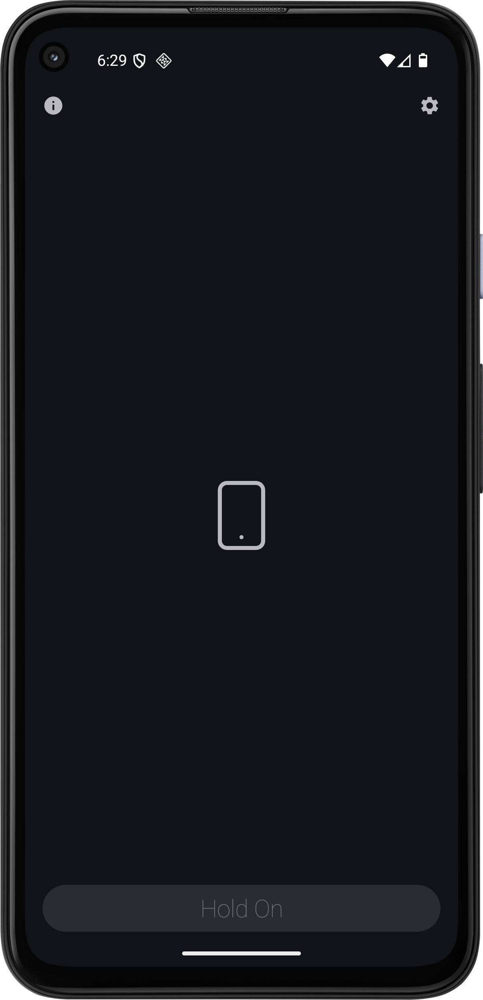
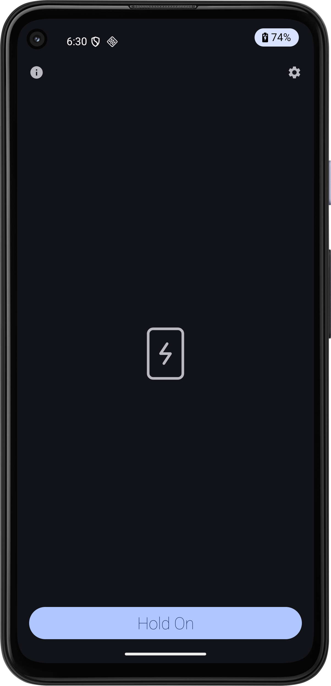
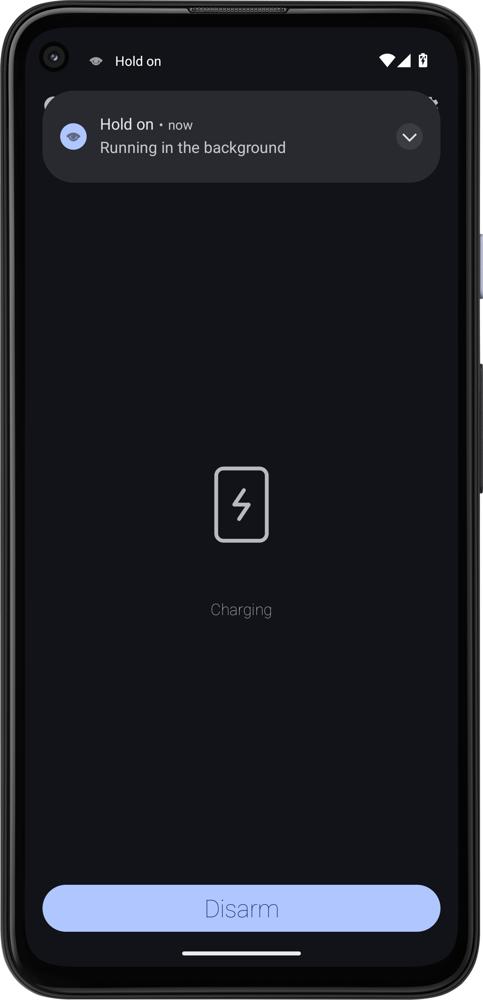

# ⚡ HoldOn – Charging Guard & Anti-Unplug Alarm


> In trains, cafés, airports, or even at home, your phone is always at risk. HoldOn acts like your personal phone bodyguard — if someone unplugs it, a **loud alarm** goes off instantly to stop them in their tracks.

> ⚡ **Even if you leave your phone charging at home and someone unplugs it, HoldOn has your back.**  
HoldOn is a smart Android app that protects your phone from theft or unauthorized unplugging. The alarm is loud enough to grab your attention, and only *you* can stop it using fingerprint or lock-screen authentication.

[Download Here](https://github.com/imgurujeet/Hold-on/releases/download/release/app-release.apk)
---

## 📱 Screenshots

  


---

## ✨ Key Features

 **Anti-Theft Protection** – Detects charger unplug, triggers loud alarm.  
 **Biometric Security** – Fingerprint/Face unlock to stop alarm.  
 **Device Lock Fallback** – PIN, Pattern, or Password authentication.  
 **Custom Alarm Sound** – Uses your own `alarm_sound.mp3` from `res/raw/`.
 **Foreground Service** – Keeps app alive with notification protection.  
 **Modern UI** – Built with Jetpack Compose.

---

## 📂 Project Structure

```plaintext
com.silentchaos.holdon
├── appNavigation/        → Navigation (NavGraph, Route)
│   ├── NavGraph.kt
│   └── Route.kt
│
├── receiver/             → BroadcastReceivers for events
│   ├── AlarmReceiver.kt
│   └── ChargingReceiver.kt
│
├── service/              → Foreground service for alarm
│   └── AlarmService.kt
│
├── ui/                   → UI screens and components
│   ├── Components/
│   │   ├── CustomDropDown.kt
│   │   ├── SocialCard.kt
│   │   └── TopBar.kt
│   │
│   ├── theme/            → Theme and styles
│   ├── HomeScreen.kt
│   ├── InfoScreen.kt
│   └── SettingScreen.kt
│
├── utils/                → Helpers & utilities
│   ├── Auth.kt
│   ├── ChargingHelper.kt
│   └── SharedPreferences.kt
│
└── MainActivity.kt       → App entry point

```


## License

[MIT](LICENSE.md)


## Contributing

Want to help? Please check out the notes in [CONTRIBUTE.md](CONTRIBUTE.md) first.


## FAQ

#### Q1: Does HoldOn work when the app is closed?
Yes, HoldOn runs as a **foreground service**, so it keeps monitoring even if you close the app.

#### Q2: Can I stop the alarm without fingerprint/lock authentication?
No, the alarm can only be stopped via **biometric or lock-screen authentication** for maximum security.

#### Q3: Will the app drain my battery?
No, HoldOn is lightweight and only monitors the charging state, so it uses minimal battery.

#### Q4: Can I customize the alarm sound?
Yes, you can set your own alarm sound from setting with availabe sounds will be adding more with future updats  
